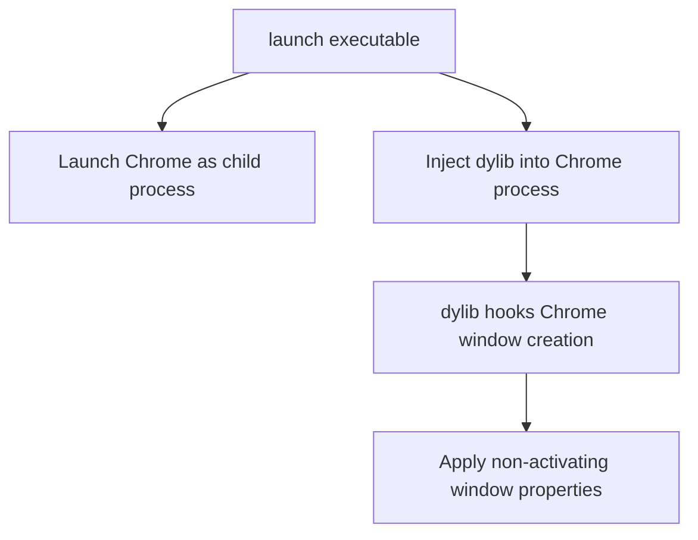

# Google Chrome Window Modification PoC - Implementation Plan

## Overview

This plan outlines the implementation of a Proof of Concept (PoC) that modifies Google Chrome windows through dylib injection. The PoC will launch Chrome as a child process and apply the following window properties:

- Non-activating window behavior
- Always-on-top positioning
- Mission Control visibility
- Screen capture bypass

## Architecture



## Implementation Components

### 1. Command-Line Launcher (`/build/launch`)

Create a simple command-line application that:
- Launches Google Chrome as a child process
- Injects our dylib into the Chrome process
- Monitors Chrome process execution

### 2. Dynamic Library (`ChromeWindowModifier.dylib`)

Create a minimal dylib that:
- Hooks into Chrome's window creation methods
- Applies non-activating window properties to Chrome windows
- Uses method swizzling to modify window behavior

### 3. Injection Mechanism

Implement a basic injection function that:
- Locates the Chrome process
- Loads our dylib into the Chrome process
- Ensures our code executes within Chrome's context

## Implementation Files

### 1. `/src/launch.m`

Main executable source to launch Chrome and inject the dylib.

### 2. `/dylib/ChromeWindowModifier.h` and `/dylib/ChromeWindowModifier.m`

Dynamic library to modify Chrome windows, reusing window property code from the existing project.

### 3. `/src/DylibInjector.h` and `/src/DylibInjector.m`

Basic injection mechanism implementation.

## Makefile Updates

Update the Makefile to:
- Build the new launcher executable
- Build the dylib
- Provide run targets for testing

## Updated Project Structure

```
project/
├── Makefile
├── README.md
├── src/
│   ├── main.m               (existing)
│   ├── AppDelegate.h        (existing)
│   ├── AppDelegate.m        (existing)
│   ├── launch.m             (new)
│   ├── DylibInjector.h      (new)
│   └── DylibInjector.m      (new)
├── dylib/
│   ├── ChromeWindowModifier.h  (new)
│   └── ChromeWindowModifier.m  (new)
└── build/
    ├── Window               (existing executable)
    ├── launch               (new executable)
    ├── obj/                 (object files)
    └── ChromeWindowModifier.dylib (new)
```

## Implementation Notes

1. **Chrome Process Management**
   - Launch Chrome with appropriate flags
   - Maintain child process relationship
   - Avoid interfering with existing Chrome instances

2. **Window Modification Strategy**
   - Target Chrome's window creation
   - Apply non-activating properties directly
   - Handle Chrome-specific window classes

3. **Injection Approach**
   - Use simplified injection for PoC purposes
   - Focus on getting basic functionality working

This plan provides a straightforward approach to demonstrate Chrome window modification without overengineering. The implementation reuses existing window property code while adding the minimal new components needed for the Chrome-specific PoC.