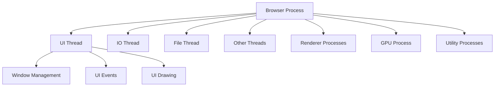
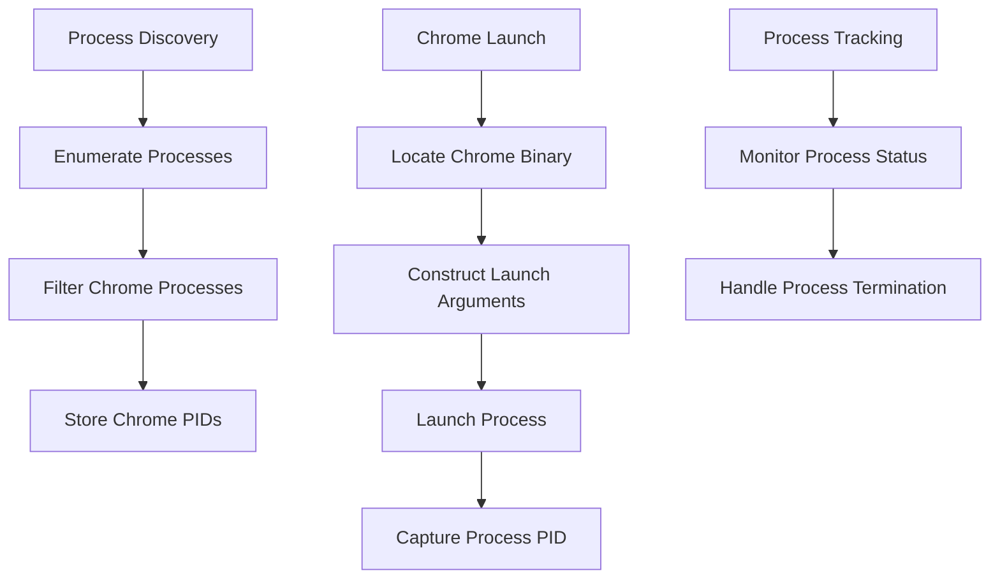
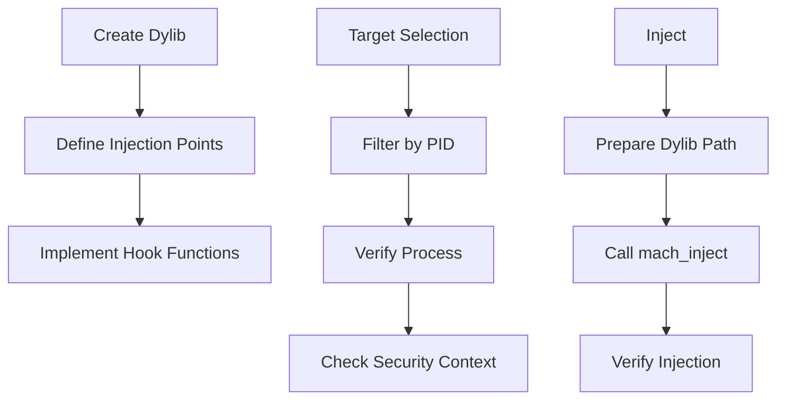
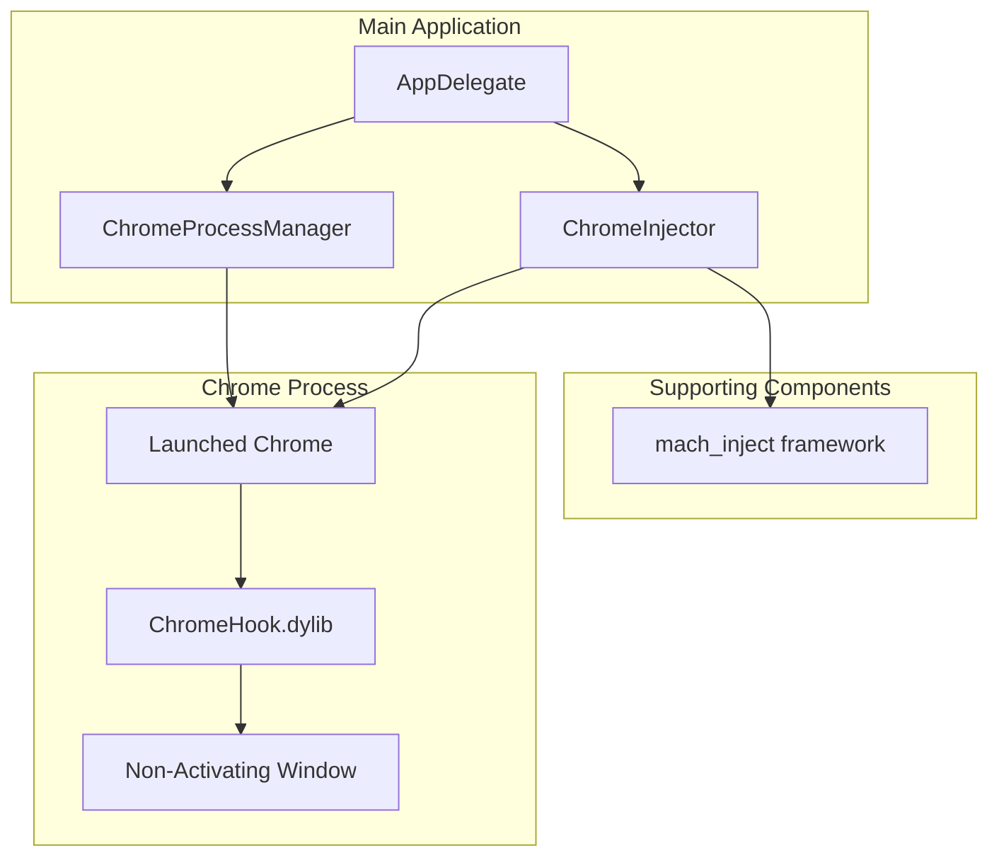

# Google Chrome-Specific PoC Refactoring Plan

## Overview

This document outlines the detailed refactoring plan for transforming our current non-activating window PoC into a Google Chrome-specific implementation. The refactored solution will enable dylib injection into a separate Chrome instance while ensuring no interference with the user's existing Chrome processes.

## Core Requirements

1. **Process Isolation**: Launch a separate Chrome instance without affecting user's existing Chrome processes
2. **Dylib Injection**: Implement a minimal but effective dylib injection mechanism
3. **Window Management**: Maintain non-activating window functionality within Chrome
4. **Clean Process Handling**: Ensure proper process isolation and cleanup

## Chrome Architecture Considerations

### Multi-Process Architecture

Chrome employs a multi-process architecture consisting of:

1. **Browser Process**: The main process that coordinates all other processes
2. **Renderer Processes**: One for each tab/iframe (isolated for security)
3. **GPU Process**: Handles GPU tasks for all renderers
4. **Utility Processes**: Various specialized processes for specific tasks
5. **Plugin/Extension Processes**: For running plugins and extensions

For our PoC, we'll focus on the Browser Process as our injection target since it:
- Controls the overall browser
- Manages the window creation
- Provides access to Chrome's UI framework

### Chrome Process Hierarchy



## Detailed Implementation Plan

### 1. Chrome Process Management



#### Process Discovery Implementation

The `ChromeProcessManager` will use macOS-specific APIs to identify existing Chrome processes:

```objective-c
@interface ChromeProcessManager : NSObject

@property (nonatomic, strong) NSMutableArray<NSNumber *> *existingChromePIDs;
@property (nonatomic, assign) pid_t launchedChromePID;

- (NSArray<NSNumber *> *)detectExistingChromeProcesses;
- (BOOL)launchChromeInstance:(NSString *)chromePath withArguments:(NSArray<NSString *> *)arguments error:(NSError **)error;
- (void)terminateOurChromeInstance;
- (BOOL)isOurChromeInstanceRunning;

@end
```

Implementation details:

```objective-c
// Detection of existing Chrome processes
- (NSArray<NSNumber *> *)detectExistingChromeProcesses {
    NSMutableArray<NSNumber *> *chromePIDs = [NSMutableArray array];
    
    // Get all processes
    int mib[4] = { CTL_KERN, KERN_PROC, KERN_PROC_ALL, 0 };
    size_t size;
    if (sysctl(mib, 4, NULL, &size, NULL, 0) == -1) {
        NSLog(@"Error: Failed to get process list size");
        return chromePIDs;
    }
    
    struct kinfo_proc *processes = malloc(size);
    if (processes == NULL) {
        NSLog(@"Error: Out of memory");
        return chromePIDs;
    }
    
    if (sysctl(mib, 4, processes, &size, NULL, 0) == -1) {
        free(processes);
        NSLog(@"Error: Failed to get process list");
        return chromePIDs;
    }
    
    size_t processCount = size / sizeof(struct kinfo_proc);
    
    // Find Chrome processes
    for (size_t i = 0; i < processCount; i++) {
        pid_t pid = processes[i].kp_proc.p_pid;
        char pathBuffer[PROC_PIDPATHINFO_MAXSIZE];
        
        if (proc_pidpath(pid, pathBuffer, sizeof(pathBuffer)) > 0) {
            NSString *processPath = [NSString stringWithUTF8String:pathBuffer];
            
            // Check if this is Google Chrome
            if ([processPath containsString:@"Google Chrome"] || 
                [processPath containsString:@"Chrome.app"]) {
                [chromePIDs addObject:@(pid)];
            }
        }
    }
    
    free(processes);
    self.existingChromePIDs = chromePIDs;
    return chromePIDs;
}

// Chrome launching implementation
- (BOOL)launchChromeInstance:(NSString *)chromePath withArguments:(NSArray<NSString *> *)arguments error:(NSError **)error {
    // Create unique temporary directory for Chrome profile
    NSString *tempDir = [NSTemporaryDirectory() stringByAppendingPathComponent:
                         [NSString stringWithFormat:@"chrome-poc-profile-%d", arc4random()]];
    
    // Prepare launch arguments
    NSMutableArray *launchArguments = [NSMutableArray arrayWithArray:arguments];
    [launchArguments addObject:[NSString stringWithFormat:@"--user-data-dir=%@", tempDir]];
    [launchArguments addObject:@"--no-first-run"];
    [launchArguments addObject:@"--no-default-browser-check"];
    [launchArguments addObject:@"--disable-sync"];
    [launchArguments addObject:@"--disable-extensions"];
    
    // Configure process launch
    NSTask *task = [[NSTask alloc] init];
    [task setLaunchPath:chromePath];
    [task setArguments:launchArguments];
    
    // Launch Chrome
    @try {
        [task launch];
        self.launchedChromePID = [task processIdentifier];
        return YES;
    } @catch (NSException *exception) {
        if (error != NULL) {
            *error = [NSError errorWithDomain:@"ChromeLauncherErrorDomain"
                                         code:1
                                     userInfo:@{NSLocalizedDescriptionKey: [exception reason]}];
        }
        return NO;
    }
}
```

#### Chrome Location Strategy

The ChromeProcessManager will implement multiple strategies to locate Chrome:

1. **Default Locations**:
   - `/Applications/Google Chrome.app/Contents/MacOS/Google Chrome`
   - `/Users/[username]/Applications/Google Chrome.app/Contents/MacOS/Google Chrome`

2. **Dynamic Discovery**:
   - Use `NSWorkspace` to find Chrome application
   - Use `mdfind` to search the system

3. **Fallback Strategy**:
   - Check for Chromium if Chrome isn't found
   - Prompt user for location if neither is found

### 2. Dylib Injection System



#### Dylib Injection Implementation

The `ChromeInjector` will handle the dylib injection process:

```objective-c
@interface ChromeInjector : NSObject

@property (nonatomic, strong) NSString *dylibPath;

- (instancetype)initWithDylibPath:(NSString *)path;
- (BOOL)injectIntoPID:(pid_t)pid error:(NSError **)error;
- (BOOL)verifyInjection:(pid_t)pid;

@end
```

Implementation details:

```objective-c
// Main injection method
- (BOOL)injectIntoPID:(pid_t)pid error:(NSError **)error {
    // Verify target is our Chrome instance
    if (![self verifyTarget:pid]) {
        if (error != NULL) {
            *error = [NSError errorWithDomain:@"InjectorErrorDomain"
                                         code:1
                                     userInfo:@{NSLocalizedDescriptionKey: @"Invalid target process"}];
        }
        return NO;
    }
    
    // Get absolute path to dylib
    NSString *absoluteDylibPath = [self.dylibPath stringByStandardizingPath];
    if (![[NSFileManager defaultManager] fileExistsAtPath:absoluteDylibPath]) {
        if (error != NULL) {
            *error = [NSError errorWithDomain:@"InjectorErrorDomain"
                                         code:2
                                     userInfo:@{NSLocalizedDescriptionKey: @"Dylib not found"}];
        }
        return NO;
    }
    
    // Convert NSString path to C string
    const char *dylibPathCStr = [absoluteDylibPath fileSystemRepresentation];
    
    // Calculate size needed for injection
    size_t dylibPathSize = strlen(dylibPathCStr) + 1;  // +1 for null terminator
    
    // Perform the actual injection using mach_inject
    kern_return_t kr = mach_inject(
        injectEntryPoint,            // The injector function (defined below)
        (const void *)dylibPathCStr, // The path to our dylib
        dylibPathSize,               // Size of our data
        pid,                         // Target PID
        0                            // Use default flags
    );
    
    if (kr != KERN_SUCCESS) {
        if (error != NULL) {
            *error = [NSError errorWithDomain:@"InjectorErrorDomain"
                                         code:3
                                     userInfo:@{NSLocalizedDescriptionKey: [NSString stringWithFormat:@"Injection failed: %s", mach_error_string(kr)]}];
        }
        return NO;
    }
    
    return [self verifyInjection:pid];
}

// Verification function to ensure we're targeting the right process
- (BOOL)verifyTarget:(pid_t)pid {
    char pathBuffer[PROC_PIDPATHINFO_MAXSIZE];
    if (proc_pidpath(pid, pathBuffer, sizeof(pathBuffer)) > 0) {
        NSString *processPath = [NSString stringWithUTF8String:pathBuffer];
        return [processPath containsString:@"Google Chrome"] || [processPath containsString:@"Chrome.app"];
    }
    return NO;
}
```

#### Dylib Structure

The `ChromeHook.dylib` will be structured as follows:

```objective-c
// ChromeHook.h
#ifndef ChromeHook_h
#define ChromeHook_h

#include <stdio.h>
#include <stdlib.h>
#include <dlfcn.h>
#include <objc/runtime.h>
#include <objc/message.h>
#include <mach-o/dyld.h>

// Entry point for the injected code
__attribute__((visibility("default")))
void injectedMain(void);

// Hook for NSWindow creation
void hookWindowCreation(void);

// Non-activating window utility functions
void makeWindowNonActivating(id window);
void setupWindowBehavior(id window);

#endif /* ChromeHook_h */
```

```objective-c
// ChromeHook.m
#import "ChromeHook.h"

// Injection entry point
__attribute__((visibility("default")))
void injectedMain(void) {
    // Detach a thread to do our work
    pthread_t thread;
    pthread_create(&thread, NULL, (void *(*)(void *))hookWindowCreation, NULL);
    pthread_detach(thread);
}

// Find and hook Chrome's window creation functions
void hookWindowCreation(void) {
    // Wait for Chrome to initialize
    usleep(500000);  // 500ms
    
    // Find Chrome's BrowserWindowController/BrowserWindow class
    Class chromeWindowClass = objc_getClass("BrowserWindowController");
    if (!chromeWindowClass) {
        chromeWindowClass = objc_getClass("BrowserWindow");
    }
    if (!chromeWindowClass) {
        NSLog(@"Failed to find Chrome window class");
        return;
    }
    
    // Hook window creation method using method swizzling
    Method originalMethod = class_getInstanceMethod(chromeWindowClass, 
                                                   @selector(windowDidLoad));
    Method replacementMethod = class_getInstanceMethod(chromeWindowClass,
                                                     @selector(hooked_windowDidLoad));
    
    if (originalMethod && replacementMethod) {
        method_exchangeImplementations(originalMethod, replacementMethod);
        NSLog(@"Successfully hooked window creation method");
    } else {
        NSLog(@"Failed to hook window creation method");
    }
}

// This is our replacement method that will be called when a Chrome window is created
static void hooked_windowDidLoad(id self, SEL _cmd) {
    // First call the original method
    ((void(*)(id, SEL))objc_msgSend)(self, @selector(orig_windowDidLoad));
    
    // Then get the NSWindow instance
    id window = ((id(*)(id, SEL))objc_msgSend)(self, @selector(window));
    
    // Apply our non-activating window behavior
    if (window) {
        makeWindowNonActivating(window);
    }
}

// Function to modify window properties to make it non-activating
void makeWindowNonActivating(id window) {
    // Apply non-activating window style mask
    NSUInteger styleMask = ((NSUInteger(*)(id, SEL))objc_msgSend)(window, @selector(styleMask));
    styleMask |= 1 << 13;  // NSWindowStyleMaskNonactivatingPanel
    ((void(*)(id, SEL, NSUInteger))objc_msgSend)(window, @selector(setStyleMask:), styleMask);
    
    // Set window level to float above other windows
    ((void(*)(id, SEL, NSInteger))objc_msgSend)(window, @selector(setLevel:), 3);  // NSFloatingWindowLevel
    
    // Setup additional window behaviors
    setupWindowBehavior(window);
}

// Setup additional window behaviors
void setupWindowBehavior(id window) {
    // Prevent screen capture
    ((void(*)(id, SEL, NSInteger))objc_msgSend)(window, @selector(setSharingType:), 0);  // NSWindowSharingNone
    
    // Set collection behaviors for Mission Control visibility
    NSUInteger collectionBehavior = 1 | (1 << 1) | (1 << 7) | (1 << 8);  // Default | CanJoinAllSpaces | ParticipatesInCycle | Managed
    ((void(*)(id, SEL, NSUInteger))objc_msgSend)(window, @selector(setCollectionBehavior:), collectionBehavior);
}
```

### 3. Updated Application Structure



#### AppDelegate Refactoring

The AppDelegate class will be refactored to coordinate the Chrome process management and injection:

```objective-c
// AppDelegate.h
#import <Cocoa/Cocoa.h>
#import "ChromeProcessManager.h"
#import "ChromeInjector.h"

@interface AppDelegate : NSObject <NSApplicationDelegate>
@property (strong, nonatomic) NSWindow *controlWindow;
@property (strong, nonatomic) ChromeProcessManager *processManager;
@property (strong, nonatomic) ChromeInjector *injector;
@end
```

```objective-c
// AppDelegate.m
#import "AppDelegate.h"

@implementation AppDelegate

- (void)applicationDidFinishLaunching:(NSNotification *)notification {
    // Create a small control window
    self.controlWindow = [[NSWindow alloc] 
                          initWithContentRect:NSMakeRect(100, 100, 300, 200)
                          styleMask:NSWindowStyleMaskTitled | 
                                   NSWindowStyleMaskClosable |
                                   NSWindowStyleMaskMiniaturizable
                          backing:NSBackingStoreBuffered
                          defer:NO];
    [self.controlWindow setTitle:@"Chrome PoC Controller"];
    
    // Initialize Chrome process manager
    self.processManager = [[ChromeProcessManager alloc] init];
    
    // Detect existing Chrome processes
    NSArray<NSNumber *> *existingChromes = [self.processManager detectExistingChromeProcesses];
    NSLog(@"Detected %lu existing Chrome processes", (unsigned long)existingChromes.count);
    
    // Find Chrome path
    NSString *chromePath = [self findChromePath];
    if (!chromePath) {
        NSLog(@"Error: Could not find Google Chrome");
        return;
    }
    
    // Launch Chrome
    NSError *launchError = nil;
    BOOL launched = [self.processManager launchChromeInstance:chromePath 
                                             withArguments:@[] 
                                                    error:&launchError];
    if (!launched) {
        NSLog(@"Failed to launch Chrome: %@", launchError);
        return;
    }
    
    pid_t chromePID = self.processManager.launchedChromePID;
    NSLog(@"Launched Chrome with PID: %d", chromePID);
    
    // Initialize injector with path to our dylib
    NSString *dylibPath = [[NSBundle mainBundle] pathForResource:@"ChromeHook" 
                                                         ofType:@"dylib"];
    self.injector = [[ChromeInjector alloc] initWithDylibPath:dylibPath];
    
    // Inject our dylib after a short delay (give Chrome time to initialize)
    dispatch_after(dispatch_time(DISPATCH_TIME_NOW, 2 * NSEC_PER_SEC), 
                   dispatch_get_main_queue(), ^{
        NSError *injectionError = nil;
        BOOL injected = [self.injector injectIntoPID:chromePID error:&injectionError];
        
        if (!injected) {
            NSLog(@"Failed to inject dylib: %@", injectionError);
        } else {
            NSLog(@"Successfully injected dylib into Chrome");
        }
    });
    
    // Setup control window UI
    [self setupControlWindowUI];
    [self.controlWindow makeKeyAndOrderFront:nil];
}

- (NSString *)findChromePath {
    // First try default locations
    NSArray *defaultLocations = @[
        @"/Applications/Google Chrome.app/Contents/MacOS/Google Chrome",
        [NSString stringWithFormat:@"%@/Applications/Google Chrome.app/Contents/MacOS/Google Chrome", 
                                  NSHomeDirectory()]
    ];
    
    for (NSString *path in defaultLocations) {
        if ([[NSFileManager defaultManager] fileExistsAtPath:path]) {
            return path;
        }
    }
    
    // If not found in default locations, try to find using NSWorkspace
    NSURL *chromeURL = [[NSWorkspace sharedWorkspace] URLForApplicationWithBundleIdentifier:@"com.google.Chrome"];
    if (chromeURL) {
        return [[chromeURL path] stringByAppendingPathComponent:@"Contents/MacOS/Google Chrome"];
    }
    
    // Fall back to Chromium if Chrome not found
    NSURL *chromiumURL = [[NSWorkspace sharedWorkspace] URLForApplicationWithBundleIdentifier:@"org.chromium.Chromium"];
    if (chromiumURL) {
        return [[chromiumURL path] stringByAppendingPathComponent:@"Contents/MacOS/Chromium"];
    }
    
    return nil;
}

- (void)setupControlWindowUI {
    NSView *contentView = [self.controlWindow contentView];
    
    // Status label
    NSTextField *statusLabel = [[NSTextField alloc] initWithFrame:NSMakeRect(20, 160, 260, 20)];
    [statusLabel setBezeled:NO];
    [statusLabel setDrawsBackground:NO];
    [statusLabel setEditable:NO];
    [statusLabel setSelectable:NO];
    [statusLabel setStringValue:@"Chrome PoC Status: Running"];
    [contentView addSubview:statusLabel];
    
    // Chrome PID label
    NSTextField *pidLabel = [[NSTextField alloc] initWithFrame:NSMakeRect(20, 130, 260, 20)];
    [pidLabel setBezeled:NO];
    [pidLabel setDrawsBackground:NO];
    [pidLabel setEditable:NO];
    [pidLabel setSelectable:NO];
    [pidLabel setStringValue:[NSString stringWithFormat:@"Chrome PID: %d", 
                             self.processManager.launchedChromePID]];
    [contentView addSubview:pidLabel];
    
    // Button to terminate Chrome
    NSButton *terminateButton = [[NSButton alloc] initWithFrame:NSMakeRect(20, 70, 260, 32)];
    [terminateButton setTitle:@"Terminate Chrome"];
    [terminateButton setBezelStyle:NSBezelStyleRounded];
    [terminateButton setTarget:self];
    [terminateButton setAction:@selector(terminateChrome:)];
    [contentView addSubview:terminateButton];
}

- (void)terminateChrome:(id)sender {
    [self.processManager terminateOurChromeInstance];
    [[self.controlWindow contentView] viewWithTag:100].stringValue = @"Chrome PoC Status: Terminated";
}

- (void)applicationWillTerminate:(NSNotification *)aNotification {
    // Clean up - ensure our Chrome instance is terminated
    [self.processManager terminateOurChromeInstance];
}

@end
```

### 4. Build System Updates

The Makefile will need to be updated to include the new files and build the dylib:

```makefile
APP_NAME = ChromePoC
BUILD_DIR = build
OBJ_DIR = $(BUILD_DIR)/obj
DYLIB_DIR = $(BUILD_DIR)/dylib
EXEC = $(BUILD_DIR)/$(APP_NAME)

CC = clang
CFLAGS = -g -fobjc-arc
FRAMEWORKS = -framework Cocoa -framework Foundation -framework AppKit
DYLIB_FLAGS = -dynamiclib -framework Foundation -framework AppKit

# Include path for mach_inject
MACH_INJECT_PATH = mach_inject
INCLUDE_PATH = -I$(MACH_INJECT_PATH)

# Main source files
SOURCES = src/main.m \
          src/AppDelegate.m \
          src/ChromeProcessManager.m \
          src/ChromeInjector.m

# Dylib source files
DYLIB_SOURCES = src/ChromeHook.m

# Object files
OBJECTS = $(patsubst src/%.m,$(OBJ_DIR)/%.o,$(SOURCES))
DYLIB_OBJECTS = $(patsubst src/%.m,$(OBJ_DIR)/dylib/%.o,$(DYLIB_SOURCES))

# mach_inject objects
MACH_INJECT_SOURCES = $(MACH_INJECT_PATH)/mach_inject.c
MACH_INJECT_OBJECTS = $(patsubst $(MACH_INJECT_PATH)/%.c,$(OBJ_DIR)/%.o,$(MACH_INJECT_SOURCES))

all: app dylib

# Create build directories
$(BUILD_DIR) $(OBJ_DIR) $(DYLIB_DIR) $(OBJ_DIR)/dylib:
	mkdir -p $@

# Compile main application objects
$(OBJ_DIR)/%.o: src/%.m | $(OBJ_DIR)
	$(CC) $(CFLAGS) $(INCLUDE_PATH) -c $< -o $@

# Compile mach_inject objects
$(OBJ_DIR)/%.o: $(MACH_INJECT_PATH)/%.c | $(OBJ_DIR)
	$(CC) $(CFLAGS) $(INCLUDE_PATH) -c $< -o $@

# Compile dylib objects
$(OBJ_DIR)/dylib/%.o: src/%.m | $(OBJ_DIR)/dylib
	$(CC) $(CFLAGS) -c $< -o $@

# Link main application
$(EXEC): $(OBJECTS) $(MACH_INJECT_OBJECTS) | $(BUILD_DIR)
	$(CC) $(CFLAGS) $(FRAMEWORKS) $(OBJECTS) $(MACH_INJECT_OBJECTS) -o $@

# Build dylib
$(DYLIB_DIR)/ChromeHook.dylib: $(DYLIB_OBJECTS) | $(DYLIB_DIR)
	$(CC) $(DYLIB_FLAGS) $(DYLIB_OBJECTS) -o $@

# Main targets
app: $(EXEC)
dylib: $(DYLIB_DIR)/ChromeHook.dylib

# Copy dylib to resources
resources: dylib
	mkdir -p $(BUILD_DIR)/Resources
	cp $(DYLIB_DIR)/ChromeHook.dylib $(BUILD_DIR)/Resources/

# Clean build files
clean:
	rm -rf $(BUILD_DIR)

# Run the application
run: app dylib resources
	$(EXEC)

.PHONY: all app dylib resources clean run
```

## Implementation Phases and Timeline

### Phase 1: Research and Setup (1 week)

1. **Chrome Process Analysis**
   - Study Chrome's process architecture on macOS
   - Identify relevant process relationships
   - Document window management system

2. **Dylib Injection Research**
   - Research mach_inject capabilities
   - Test basic injection into simple processes
   - Document security constraints

3. **Environment Setup**
   - Set up development environment
   - Gather necessary headers and frameworks
   - Create project structure

### Phase 2: Core Components Implementation (2 weeks)

1. **Chrome Process Manager Implementation**
   - Process discovery functionality 
   - Chrome launching with isolation
   - Process monitoring and termination

2. **Basic Dylib Framework**
   - Create basic dylib structure
   - Implement entry point
   - Test loading in simple applications

3. **Injection Mechanism**
   - Implement ChromeInjector class
   - Create process verification system
   - Initial testing with sample applications

### Phase 3: Integration and Chrome-Specific Features (2 weeks)

1. **Chrome Window Hooking**
   - Research Chrome's window management
   - Create window hook mechanism
   - Implement non-activating window behavior

2. **System Integration**
   - Connect all components
   - Create control UI
   - Implement error handling

3. **Testing with Chrome**
   - Test with different Chrome versions
   - Verify process isolation
   - Debug injection issues

### Phase 4: Final Polish and Documentation (1 week)

1. **Code Optimization**
   - Optimize for minimal processing
   - Address edge cases
   - Ensure clean termination

2. **Documentation**
   - Code documentation
   - User guide
   - Technical specifications

3. **Final Testing**
   - Comprehensive testing
   - Security verification
   - Performance evaluation

## Technical Challenges and Solutions

### 1. Chrome's Multi-Process Architecture

**Challenge**: Chrome uses multiple processes that communicate using IPC, making it difficult to track the correct target process.

**Solution**: 
- Focus specifically on the Browser process by filtering process names and parent-child relationships
- Use dynamic target identification based on Chrome's process characteristics
- Implement process verification before injection

### 2. Chrome Updates Breaking Functionality

**Challenge**: Chrome's frequent updates may change internal structures, breaking our hooks.

**Solution**:
- Use general hooking techniques that rely on Objective-C runtime rather than specific memory addresses
- Implement multiple fallback strategies for locating key functionality
- Add version detection to adjust behavior based on Chrome version

### 3. macOS Security Mechanisms

**Challenge**: macOS implements several security mechanisms that may prevent dylib injection.

**Solution**:
- Use approved methods like mach_inject that work within macOS security constraints
- Implement proper code signing for dylib
- Document any required security exceptions for development

### 4. Process Isolation

**Challenge**: Ensuring our Chrome instance doesn't interfere with user's existing Chrome processes.

**Solution**:
- Use custom isolated profile directory
- Implement specific Chrome command-line flags to prevent profile contamination
- Carefully manage and monitor process lifecycle

### 5. Chrome's Window Management

**Challenge**: Chrome implements custom window management that may conflict with our non-activating window approach.

**Solution**:
- Hook into Chrome's window creation chain early
- Use Objective-C method swizzling for reliable interception
- Implement window property modifications that work with Chrome's window manager

## Conclusion

This detailed implementation plan provides a comprehensive roadmap for refactoring our non-activating window PoC into a Google Chrome-specific implementation. By focusing on minimal but sufficient functionality, we can create an effective proof of concept that demonstrates:

1. Process isolation from existing Chrome instances
2. Dylib injection into a Chrome process
3. Window behavior modifications within Chrome

The plan prioritizes clean implementation while maintaining the core functionality required for the PoC. Each component is designed to be minimal while still providing the necessary capabilities, ensuring we don't include unnecessary processing or logic.
