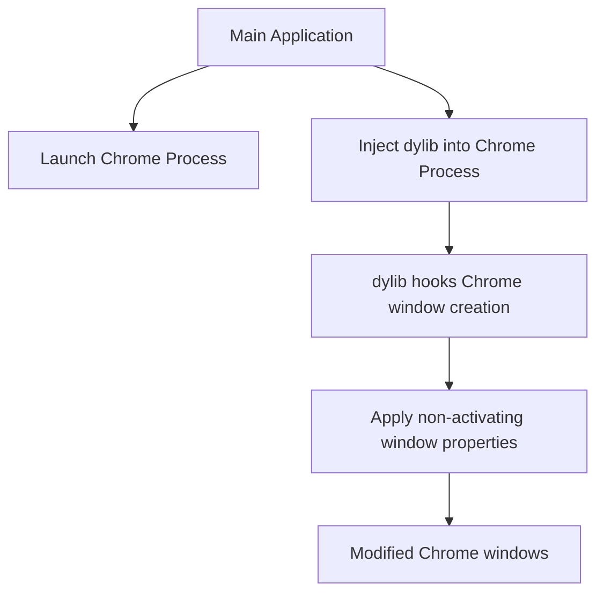

# Google Chrome Window Modification PoC - Implementation Plan

## Project Overview

This document outlines the implementation plan for a Proof of Concept (PoC) that modifies Google Chrome windows using dylib injection. The goal is to apply the following properties to Chrome windows:

- **Non-activating window**: Allow Chrome windows to receive key input without stealing focus
- **Always on top**: Keep Chrome windows above other windows
- **Mission Control visibility**: Ensure Chrome windows show up in Mission Control
- **Screen capture bypass**: Prevent Chrome windows from being captured in screenshots or recordings

## Architecture



## Component Breakdown

### 1. Main Application

The existing application will be enhanced to:
- Launch Google Chrome as a child process
- Inject our custom dylib into the Chrome process
- Maintain the non-activating window capabilities of the original demo

### 2. Dynamic Library (dylib)

A new dynamic library will be created to:
- Hook into Chrome's window creation methods
- Modify window properties on the fly
- Apply custom window behaviors

### 3. Injection Mechanism

Code to handle:
- Process identification
- Dynamic library injection
- Runtime hooking

## Implementation Details

### 1. Main Application Updates

#### AppDelegate.m Modifications

- Add Chrome process launching functionality:
  ```objective-c
  - (void)launchChromeProcess {
      NSTask *chromeTask = [[NSTask alloc] init];
      
      // Configure Chrome launch path
      NSString *chromePath = @"/Applications/Google Chrome.app/Contents/MacOS/Google Chrome";
      [chromeTask setLaunchPath:chromePath];
      
      // Configure arguments (can include specific flags as needed)
      [chromeTask setArguments:@[@"--args", @"--new-window"]];
      
      // Launch Chrome
      [chromeTask launch];
      
      // Store process ID for injection
      pid_t chromePID = [chromeTask processIdentifier];
      
      // Inject dylib
      [self injectDylibIntoChromeProcess:chromePID];
  }
  ```

- Add interface button to trigger Chrome launch:
  ```objective-c
  - (void)applicationDidFinishLaunching:(NSNotification *)notification {
      // Existing window setup code...
      
      // Add a button to launch Chrome
      NSButton *launchButton = [[NSButton alloc] initWithFrame:NSMakeRect(50, 100, 300, 30)];
      [launchButton setTitle:@"Launch Modified Chrome"];
      [launchButton setBezelStyle:NSBezelStyleRounded];
      [launchButton setTarget:self];
      [launchButton setAction:@selector(launchChromeButtonClicked:)];
      [[self.window contentView] addSubview:launchButton];
  }
  
  - (void)launchChromeButtonClicked:(id)sender {
      [self launchChromeProcess];
  }
  ```

- Add dylib injection method:
  ```objective-c
  - (void)injectDylibIntoChromeProcess:(pid_t)pid {
      // Path to our dylib
      NSString *dylibPath = [[NSBundle mainBundle] pathForResource:@"ChromeWindowModifier" ofType:@"dylib"];
      
      // Injection code will go here
      // This is a placeholder for the actual injection mechanism
      BOOL success = [self injectDylib:dylibPath intoPID:pid];
      
      if (success) {
          NSLog(@"Successfully injected dylib into Chrome process %d", pid);
      } else {
          NSLog(@"Failed to inject dylib into Chrome process %d", pid);
      }
  }
  ```

### 2. Dynamic Library Implementation

#### ChromeWindowModifier.dylib Structure

Create a new directory `dylib` with the following files:

#### dylib/ChromeWindowModifier.h
```objective-c
#import <Foundation/Foundation.h>
#import <Cocoa/Cocoa.h>
#import <objc/runtime.h>

// Main entry point for the dylib
__attribute__((constructor))
void ChromeWindowModifierInit(void);

// Notification handler for new windows
void HandleWindowCreation(NSNotification *notification);

// Method swizzling utilities
void SwizzleMethod(Class class, SEL originalSelector, SEL swizzledSelector);

// Window modification methods
void ApplyNonActivatingProperties(NSWindow *window);
```

#### dylib/ChromeWindowModifier.m
```objective-c
#import "ChromeWindowModifier.h"

__attribute__((constructor))
void ChromeWindowModifierInit(void) {
    // Register for window notifications
    [[NSNotificationCenter defaultCenter] addObserver:[NSObject new]
                                             selector:@selector(handleWindowCreation:)
                                                 name:NSWindowDidCreateNotification
                                               object:nil];
    
    // Setup method swizzling
    Class windowClass = NSClassFromString(@"NSWindow");
    
    // Swizzle window initialization methods
    SwizzleMethod(windowClass, 
                  @selector(initWithContentRect:styleMask:backing:defer:),
                  @selector(swizzled_initWithContentRect:styleMask:backing:defer:));
    
    NSLog(@"ChromeWindowModifier: Initialized and ready");
}

void HandleWindowCreation(NSNotification *notification) {
    NSWindow *window = notification.object;
    
    // Check if this is a Chrome window
    // This is a simplified check and may need refinement
    NSString *windowTitle = [window title];
    if ([windowTitle containsString:@"Chrome"] || 
        [[[NSProcessInfo processInfo] processName] containsString:@"Chrome"]) {
        
        ApplyNonActivatingProperties(window);
    }
}

void ApplyNonActivatingProperties(NSWindow *window) {
    // Skip if already modified
    if ([objc_getAssociatedObject(window, "ChromeWindowModified") boolValue]) {
        return;
    }
    
    // Mark as modified
    objc_setAssociatedObject(window, "ChromeWindowModified", @YES, OBJC_ASSOCIATION_RETAIN_NONATOMIC);
    
    // Apply non-activating properties
    [window setStyleMask:[window styleMask] | NSWindowStyleMaskNonactivatingPanel];
    [window setLevel:NSFloatingWindowLevel];
    [window setSharingType:NSWindowSharingNone];
    
    // Configure for Mission Control and window management
    [window setCollectionBehavior:NSWindowCollectionBehaviorDefault | 
                                 NSWindowCollectionBehaviorCanJoinAllSpaces |
                                 NSWindowCollectionBehaviorParticipatesInCycle |
                                 NSWindowCollectionBehaviorManaged];
    
    NSLog(@"ChromeWindowModifier: Modified Chrome window: %@", [window title]);
}

void SwizzleMethod(Class class, SEL originalSelector, SEL swizzledSelector) {
    Method originalMethod = class_getInstanceMethod(class, originalSelector);
    Method swizzledMethod = class_getInstanceMethod(class, swizzledSelector);
    
    BOOL didAddMethod = class_addMethod(class, 
                                       originalSelector,
                                       method_getImplementation(swizzledMethod),
                                       method_getTypeEncoding(swizzledMethod));
    
    if (didAddMethod) {
        class_replaceMethod(class, 
                           swizzledSelector,
                           method_getImplementation(originalMethod),
                           method_getTypeEncoding(originalMethod));
    } else {
        method_exchangeImplementations(originalMethod, swizzledMethod);
    }
}

// Swizzled method implementation
@implementation NSWindow (ChromeWindowModifier)

- (instancetype)swizzled_initWithContentRect:(NSRect)contentRect 
                                  styleMask:(NSWindowStyleMask)style 
                                    backing:(NSBackingStoreType)backingStoreType 
                                      defer:(BOOL)flag {
    
    // Call original implementation
    NSWindow *window = [self swizzled_initWithContentRect:contentRect 
                                               styleMask:style 
                                                 backing:backingStoreType 
                                                   defer:flag];
    
    // Check if this is a Chrome window and we're in the Chrome process
    if ([[[NSProcessInfo processInfo] processName] containsString:@"Chrome"]) {
        ApplyNonActivatingProperties(window);
    }
    
    return window;
}

@end
```

### 3. Dylib Injection Mechanism

Create a new file for the injection mechanism:

#### src/DylibInjector.h
```objective-c
#import <Foundation/Foundation.h>

@interface DylibInjector : NSObject

+ (BOOL)injectDylib:(NSString *)dylibPath intoPID:(pid_t)pid;

@end
```

#### src/DylibInjector.m
```objective-c
#import "DylibInjector.h"
#include <stdio.h>
#include <stdlib.h>
#include <dlfcn.h>
#include <mach/mach.h>
#include <mach/mach_vm.h>
#include <mach/mach_error.h>
#include <mach/thread_act.h>
#include <pthread.h>
#include <sys/types.h>

@implementation DylibInjector

+ (BOOL)injectDylib:(NSString *)dylibPath intoPID:(pid_t)pid {
    task_t remoteTask;
    kern_return_t kr = task_for_pid(mach_task_self(), pid, &remoteTask);
    if (kr != KERN_SUCCESS) {
        NSLog(@"Error getting task for pid %d: %s", pid, mach_error_string(kr));
        return NO;
    }
    
    // Allocate memory in the remote process
    mach_vm_address_t remoteStack = 0;
    mach_vm_size_t stackSize = 0x4000; // 16KB for stack
    kr = mach_vm_allocate(remoteTask, &remoteStack, stackSize, VM_FLAGS_ANYWHERE);
    if (kr != KERN_SUCCESS) {
        NSLog(@"Error allocating stack memory: %s", mach_error_string(kr));
        return NO;
    }
    
    // Allocate memory for the path string in the remote process
    mach_vm_address_t remoteDylibPath = 0;
    size_t dylibPathLength = [dylibPath lengthOfBytesUsingEncoding:NSUTF8StringEncoding] + 1;
    kr = mach_vm_allocate(remoteTask, &remoteDylibPath, dylibPathLength, VM_FLAGS_ANYWHERE);
    if (kr != KERN_SUCCESS) {
        NSLog(@"Error allocating memory for dylib path: %s", mach_error_string(kr));
        return NO;
    }
    
    // Copy the path string to the remote process
    kr = mach_vm_write(remoteTask, remoteDylibPath, (vm_offset_t)[dylibPath UTF8String], (mach_msg_type_number_t)dylibPathLength);
    if (kr != KERN_SUCCESS) {
        NSLog(@"Error writing dylib path: %s", mach_error_string(kr));
        return NO;
    }
    
    // Get the address of dlopen in the remote process
    void *dlopen_addr = dlsym(RTLD_DEFAULT, "dlopen");
    if (!dlopen_addr) {
        NSLog(@"Error finding dlopen: %s", dlerror());
        return NO;
    }
    
    // Create a remote thread that calls dlopen
    thread_act_t remoteThread;
    
    // This is a simplified example - actual implementation would need to set up the thread state correctly
    kr = thread_create_running(remoteTask, x86_THREAD_STATE64, NULL, 0, &remoteThread);
    if (kr != KERN_SUCCESS) {
        NSLog(@"Error creating remote thread: %s", mach_error_string(kr));
        return NO;
    }
    
    // Note: In a real implementation, you would need to:
    // 1. Set up the thread state to call dlopen with the remote path
    // 2. Wait for the thread to complete
    // 3. Clean up allocated resources
    
    // This is a placeholder for the actual injection code
    NSLog(@"Dylib injection mechanism requires platform-specific implementation");
    
    return YES; // Placeholder return
}

@end
```

### 4. Makefile Updates

Update the Makefile to include building the dylib:

```makefile
APP_NAME = Window
BUILD_DIR = build
OBJ_DIR = $(BUILD_DIR)/obj
DYLIB_DIR = $(BUILD_DIR)/dylib
EXEC = $(BUILD_DIR)/$(APP_NAME)
DYLIB = $(DYLIB_DIR)/ChromeWindowModifier.dylib

CC = clang
CFLAGS = -g -fobjc-arc
FRAMEWORKS = -framework Cocoa
DYLIB_FLAGS = -dynamiclib -install_name @executable_path/dylib/ChromeWindowModifier.dylib

SOURCES = src/main.m src/AppDelegate.m src/DylibInjector.m
OBJECTS = $(patsubst src/%.m,$(OBJ_DIR)/%.o,$(SOURCES))

DYLIB_SOURCES = dylib/ChromeWindowModifier.m
DYLIB_OBJECTS = $(patsubst dylib/%.m,$(DYLIB_DIR)/%.o,$(DYLIB_SOURCES))

all: app dylib

$(BUILD_DIR) $(OBJ_DIR) $(DYLIB_DIR):
	mkdir -p $@

$(OBJ_DIR)/%.o: src/%.m | $(OBJ_DIR)
	$(CC) $(CFLAGS) -c $< -o $@

$(DYLIB_DIR)/%.o: dylib/%.m | $(DYLIB_DIR)
	$(CC) $(CFLAGS) -c $< -o $@

$(EXEC): $(OBJECTS) | $(BUILD_DIR)
	$(CC) $(CFLAGS) $(FRAMEWORKS) $(OBJECTS) -o $@
	mkdir -p $(EXEC)/Contents/Resources/dylib

$(DYLIB): $(DYLIB_OBJECTS) | $(DYLIB_DIR)
	$(CC) $(DYLIB_FLAGS) $(FRAMEWORKS) $(DYLIB_OBJECTS) -o $@
	cp $(DYLIB) $(EXEC)/Contents/Resources/

app: $(EXEC)

dylib: $(DYLIB)

clean:
	rm -rf $(BUILD_DIR)

run: app dylib
	$(EXEC)

.PHONY: all app dylib clean run
```

## Project File Structure

After implementation, the project structure will look like:

```
project/
├── Makefile
├── README.md
├── src/
│   ├── main.m
│   ├── AppDelegate.h
│   ├── AppDelegate.m
│   ├── DylibInjector.h
│   └── DylibInjector.m
├── dylib/
│   ├── ChromeWindowModifier.h
│   └── ChromeWindowModifier.m
└── build/
    ├── Window (executable)
    ├── obj/ (object files)
    └── dylib/
        └── ChromeWindowModifier.dylib
```

## Implementation Notes

1. **Dylib Injection Mechanism**:
   - The injection code provided is a simplified placeholder
   - Real implementation will need to properly set up thread state for the target architecture
   - Permissions may require special considerations (SIP, entitlements)

2. **Chrome Window Detection**:
   - The current approach uses window title and process name checks
   - May need refinement for different Chrome versions or configurations

3. **Method Swizzling Considerations**:
   - Chrome may use custom window classes that require different hooks
   - Window creation timing might require additional observation points

4. **Security Considerations**:
   - The injection requires privileged operations
   - Be aware of macOS security restrictions that may affect functionality

5. **Process Management**:
   - Chrome operates with multiple processes; injection target must be the UI process
   - Process monitoring may be needed for multi-window scenarios

This implementation plan provides a foundation for creating a PoC that demonstrates modifying Google Chrome windows with the same non-activating window properties as the original demo.